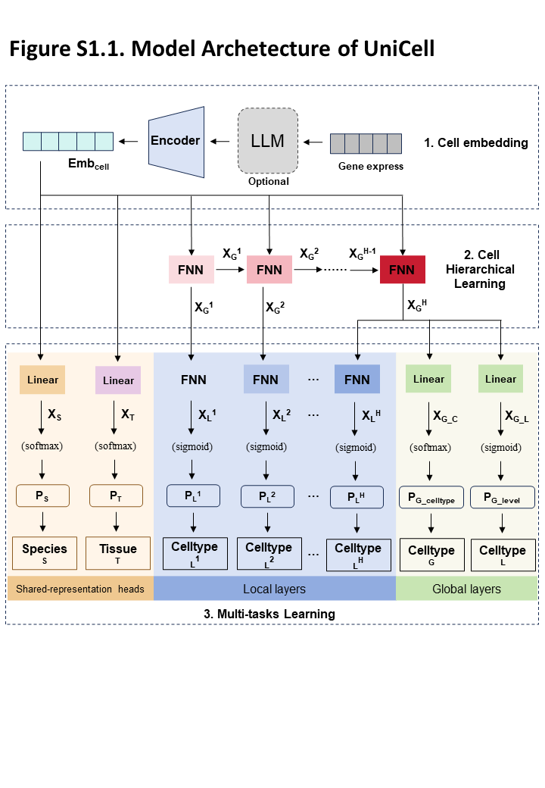

# 🧠 UniCell Model Architecture

This module defines the **HMCN (Hierarchical Multi-Label Classification Network)** architecture used in UniCell for ontology-guided cell-type learning with auxiliary tissue and organism classification.



---

## 📦 Components

### 1. `Encoder`

A feed-forward neural encoder designed to process representations from different input types (`expr`, `scGPT`, etc.).

```python
Encoder(input_type, d_model, output_dim=128, dropout=0.1)
```

- `input_type`: `"expr"` or `"scGPT"` influences dropout behavior.
- Applies a multi-layer perceptron with normalization and ReLU activations.

---

### 2. `ClsDecoder`

A decoder used for classification tasks. Applies multiple linear layers with activations and layer normalization before producing final logits.

```python
ClsDecoder(d_model, n_cls, nlayers=3)
```

- `d_model`: Input embedding dimension
- `n_cls`: Number of output classes

---

### 3. `HMCN` – Hierarchical Multi-Label Classifier

The core architecture of UniCell for hierarchical multi-task classification. It integrates expression or foundation-model embeddings, feeds them through Cell Ontology local and global layers, and adds flat cell-type, tissue, and organism heads.

```python
HMCN(
    input_type,
    input_dim,
    output_dim,
    num_classes,
    hierarchical_depth,
    global2local,
    hierarchical_class,
    hidden_layer_dropout,
    cls_num,
    tissue_cls_num,
    species_cls_num,
    llm_model_file,
    llm_vocab_file,
    llm_args_file
)
```

- Supports input types: `"expr"`, `"scFoundation"`, `"GeneFormer"`, and `"scGPT"`
- Freezes most scFoundation encoder layers while leaving a selected late transformer block trainable
- Builds multiple global and local classifiers per hierarchical level
- Produces:
  - Final global hierarchy representation
  - Global hierarchy-level output
  - Per-level local hierarchy outputs
  - Flat cell-type logits
  - Tissue logits
  - Organism logits, named `species_cls_output` in code

---

## ⚙️ LLM Integration

- **scFoundation**: Loaded via `load_model_frommmf`, uses transformer-based encoder with token & position embeddings.
- **GeneFormer**: `BertForMaskedLM` (via `transformers`)
- **scGPT**: Custom `TransformerModel` with flexible configurations loaded via:

```python
load_gpt_model(vocab, args, model_file)
```

---

## 🧊 Freezing Model Layers

The helper function `freezon_model` allows freezing model parameters except for specified layers.

```python
freezon_model(model, keep_layers=["encoder.layer.11", ...])
```

---

## 🔄 Forward Pass Flow

The model supports various input types. During the forward pass:

1. LLM encoder (e.g. GeneFormer or scGPT) produces embeddings.
2. `Encoder` refines the representation.
3. Each hierarchical level passes through:
   - Global transformation layer
   - Local classifier
4. The final global hierarchy representation drives the flat cell-type head.
5. The shared encoded representation directly drives the tissue and organism heads.

The forward method returns six values:

```python
(
    global_layer_activation,
    global_layer_output,
    local_layer_outputs,
    global_cls_output,
    tissue_cls_output,
    species_cls_output,
) = model(batch_data)
```

During inference, the three flat-head logits can undergo sequential post-hoc safe-list decoding as `organism/species -> tissue -> cell type`. The hierarchy outputs are not used by this decoder.

---

## 📌 Notes

- Hierarchical levels are dynamically constructed based on `hierarchical_depth`.
- For non-scGPT inputs, global and local hierarchy outputs are passed through sigmoid; scGPT hierarchy outputs remain logits for cross-entropy loss.
- The flat cell-type, tissue, and organism heads return raw logits for all input types.
- `species` is the implementation name for the organism task; the project default label column is `adata.obs["organism"]`.

---
