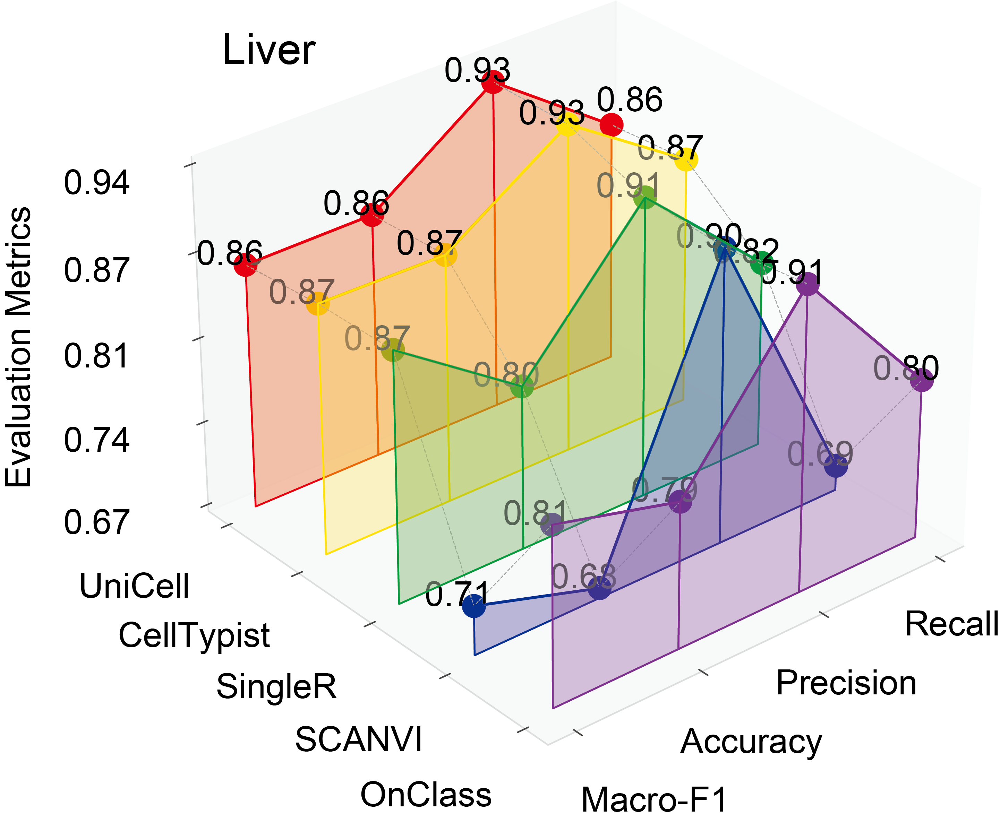

# 📘 Benchmarking UniCell for Cell-type Annotation

This notebook demonstrates how to train and benchmark the **UniCell** model for ontology-guided cell-type annotation. The current model jointly learns cell type, tissue, and organism while retaining cell-type comparison with:

- **scANVI** (v1.0.2)
- **OnClass** (v1.3)
- **CellTypist** (v1.6.2)
- **SingleR** (v0.4.6)

We use the human liver dataset for training and evaluation. The dataset includes pre-split training, evaluation, and test sets. Training and evaluation data must contain non-missing `cell_type_ontology_term_id`, `general_tissue`, and `organism` values in `.obs`.

---

## 📂 Dataset and Setup

- Demo data can be downloaded from:  
https://bgipan.genomics.cn/#/link/Z2z61owwv8WAqbuIcCdB  
🔑 Extraction code: `YC3A`

Make sure to download the dataset folder from your data source. The following assumes a structure like:

- `data/hsa_liver_train.h5ad`
- `data/hsa_liver_eval.h5ad`
- `data/hsa_liver_test.h5ad`

The embedded benchmark figure is retained as an illustration of the workflow. Re-run the notebook with the current joint checkpoint to regenerate numerical results for the organism+tissue version.

---

## 🧭 Workflow Summary

1. Train UniCell on a new dataset
2. Evaluate UniCell on the test set
3. Compare performance with four classifiers

---

## Step 1: Train UniCell on Human Liver

```python
from unicell.scDataset import scDataset
from unicell.trainer import UnicellTrainer
import pickle, os
import numpy as np

prefix = "hsa_liver"
train_data_path = "data/hsa_liver_train.h5ad"
sc_train = scDataset(
    data_path=train_data_path,
    cell_type_key="cell_type_ontology_term_id",
    tissue_key="general_tissue",
    species_key="organism",
    trained=True,
    highly_variable_genes=True
)

input_dim = sc_train.adata.shape[1]
ckpt_dir = os.path.join("models", prefix)
os.makedirs(ckpt_dir, exist_ok=True)

with open(os.path.join(ckpt_dir, 'gene_names.pk'), 'wb') as w1:
    pickle.dump(sc_train.adata.var_names, w1)
sc_train.ontograph.pickle(ckpt_dir)

trainer = UnicellTrainer(
    sc_train,
    input_type="expr",
    input_dim=input_dim,
    output_dim=512,
    batch_size=128,
    learning_rate=0.001,
    num_epochs=50,
    beta=0.1,
    device="cuda",
    global_layer=128,
    local_layer=64,
    hidden_layer_dropout=0.1,
    ckpt_dir=ckpt_dir
)

eval_data_path = os.path.join(f"data/hsa_liver_eval.h5ad")
sc_eval = scDataset(adata=None,
                    data_path=eval_data_path,
                    cell_type_key="cell_type_ontology_term_id",
                    tissue_key="general_tissue",
                    species_key="organism",
                    trained=False,
                    highly_variable_genes=False)

missing_eval_genes = sc_train.adata.var_names.difference(sc_eval.adata.var_names)
if len(missing_eval_genes):
    raise ValueError(f"Evaluation data is missing {len(missing_eval_genes)} training genes")

sc_eval.adata = sc_eval.adata[:, sc_train.adata.var_names]
sc_eval.ontograph = sc_train.ontograph
sc_eval.cell_type_index = sc_eval.get_cell_type_index()

# Reuse training-set encodings for the two auxiliary tasks.
eval_tissues = sc_eval.adata.obs["general_tissue"].astype(str)
eval_species = sc_eval.adata.obs["organism"].astype(str)
unseen_tissues = sorted(set(eval_tissues) - set(sc_train.tissue_label_dict))
unseen_species = sorted(set(eval_species) - set(sc_train.species_label_dict))
if unseen_tissues or unseen_species:
    raise ValueError(
        f"Labels not seen during training: tissue={unseen_tissues}, organism={unseen_species}"
    )

sc_eval.tissue_label_dict = sc_train.tissue_label_dict
sc_eval.species_label_dict = sc_train.species_label_dict
sc_eval.tissue_index = np.array(
    [sc_train.tissue_label_dict[x] for x in eval_tissues], dtype=np.int64
)
sc_eval.species_index = np.array(
    [sc_train.species_label_dict[x] for x in eval_species], dtype=np.int64
)

trainer.train(scdata_test=sc_eval)


```

---

## Step 2: Evaluate on the Test Set

```python
from unicell.anno_predict import unicell_predict
from unicell.utils.utils import compute_metrics
import scanpy as sc

test_data_path = "data/hsa_liver_test.h5ad"
# unicell_predict copies this AnnData and applies the same heuristic expression
# preprocessing used by the training/evaluation reader.
adata_test = sc.read_h5ad(test_data_path)
sc_dataset = unicell_predict(
    adata=adata_test,
    filepath=test_data_path,
    ckpt_dir=ckpt_dir,
    batch_size=512,
    device="cuda",
    cell_type_key="cell_type_ontology_term_id",
    tissue_key="general_tissue",
    species_key="organism",
    compute_metrics=True,
    safe_list_path=None
)

cell_type_metrics = compute_metrics(
    sc_dataset.adata.obs['cell_type_ontology_term_id'],
    sc_dataset.adata.obs["predicted_cell_type_ontology_id"]
)
tissue_metrics = compute_metrics(
    sc_dataset.adata.obs['general_tissue'],
    sc_dataset.adata.obs["predicted_tissue"]
)
organism_metrics = compute_metrics(
    sc_dataset.adata.obs['organism'],
    sc_dataset.adata.obs["predicted_species"]
)

print("UniCell cell-type metrics:", cell_type_metrics)
print("UniCell tissue metrics:", tissue_metrics)
print("UniCell organism metrics:", organism_metrics)
```

---

## Step 3: Compare with scANVI, OnClass, CellTypist, SingleR

```python
import scanpy as sc
import pandas as pd
import re

adata_test = sc.read_h5ad(".../runs/results/hsa_liver_preds.h5ad")
sc_dataset.adata.obs["celltypist_predicted_cell_type"] = adata_test.obs["celltypist_predicted_cell_type"]
sc_dataset.adata.obs["scanvi_predicted_cell_type"] = adata_test.obs["scanvi_predicted_cell_type"]
sc_dataset.adata.obs["onclass_predicted_cell_type"] = [sc_dataset.ontograph.id2name[key] for key in adata_test.obs["onclass_predicted_cell_type"]]
sc_dataset.adata.obs["singler_predicted_cell_type"] = adata_test.obs["singler_predicted_cell_type"]

if "cell_type" not in sc_dataset.adata.obs:
    sc_dataset.adata.obs["cell_type"] = [
        sc_dataset.ontograph.id2name.get(cell_type_id, cell_type_id)
        for cell_type_id in sc_dataset.adata.obs["cell_type_ontology_term_id"]
    ]
sc_dataset.adata.obs["unicell_predicted_cell_type"] = [
    sc_dataset.ontograph.id2name.get(cell_type_id, cell_type_id)
    for cell_type_id in sc_dataset.adata.obs["predicted_cell_type_ontology_id"]
]

from sklearn.metrics import accuracy_score, f1_score, precision_score, recall_score

prediction_columns = {
    "unicell": "unicell_predicted_cell_type",
    "celltypist": "celltypist_predicted_cell_type",
    "scanvi": "scanvi_predicted_cell_type",
    "onclass": "onclass_predicted_cell_type",
    "singler": "singler_predicted_cell_type",
}
y_true = sc_dataset.adata.obs["cell_type"].astype(str)
metric_rows = []
for method, prediction_key in prediction_columns.items():
    y_pred = sc_dataset.adata.obs[prediction_key].astype(str)
    metric_rows.append({
        "method": method,
        "F1": f1_score(y_true, y_pred, average="macro", zero_division=0),
        "Accuracy": accuracy_score(y_true, y_pred),
        "Precision": precision_score(y_true, y_pred, average="macro", zero_division=0),
        "Recall": recall_score(y_true, y_pred, average="macro", zero_division=0),
    })
eval_df = pd.DataFrame(metric_rows)
```

---
## 📊 Visualize Evaluation Metrics

The cell-type benchmark compares UniCell with four other classifiers: `scANVI`, `OnClass`, `CellTypist`, and `SingleR`. Tissue and organism metrics above are reported separately because the comparison methods do not share these UniCell auxiliary heads. Each cell-type method is evaluated based on:

- **Precision**
- **Recall**
- **Accuracy**
- **Macro F1 Score**

```python
import numpy as np
import matplotlib.pyplot as plt
from mpl_toolkits.mplot3d.art3d import Poly3DCollection
from palettable.cartocolors.diverging import TealRose_5

selected_df = eval_df.iloc[:, 1:5].to_numpy()
min_value = max(0, round(selected_df.min(), 2) - 0.01)
max_value = min(1, round(selected_df.max(), 2) + 0.01)
methods_label = ['F1', 'Accuracy', 'Precision', 'Recall']
methods = np.arange(len(methods_label))
datasets_reversed = eval_df["method"].values
datasets = np.arange(len(datasets_reversed))
X, Y = np.meshgrid(methods, datasets)
colors = TealRose_5.mpl_colors[::-1]
color_map = dict(zip(['unicell', 'celltypist', 'scanvi', 'onclass', 'singler'], colors))

fig = plt.figure(figsize=(6, 5))
ax = fig.add_subplot(111, projection='3d')

for i in range(selected_df.shape[0]):
    dataset_name = datasets_reversed[i]
    color = color_map.get(dataset_name, "gray")
    ax.plot(X[i], Y[i], selected_df[i], '-o', color=color, markersize=5)

    for j in range(selected_df.shape[1] - 1):
        verts = [
            [X[i, j], Y[i, j], min_value],
            [X[i, j + 1], Y[i, j + 1], min_value],
            [X[i, j + 1], Y[i, j + 1], selected_df[i, j + 1]],
            [X[i, j], Y[i, j], selected_df[i, j]]
        ]
        poly = Poly3DCollection([verts], color=color, alpha=0.3)
        ax.add_collection3d(poly)

    for j in range(selected_df.shape[1]):
        ax.text(X[i, j], Y[i, j], selected_df[i, j],
                f'{selected_df[i, j]:.2f}', color='black', ha='center')

# Connect lines
for j in range(selected_df.shape[1]):
    ax.plot(X[:, j], Y[:, j], selected_df[:, j], '--', color='gray', linewidth=0.5)

# Labels and ticks
ax.set_xlabel('') 
ax.set_ylabel('') 
ax.set_zlabel('Evaluation Metrics')
ax.set_xticks(range(len(methods_label)))
ax.set_xticklabels(methods_label)
ax.set_yticks(range(len(datasets_reversed)))
ax.set_yticklabels(datasets_reversed)
ax.set_zlim(min_value, max_value)
z_ticks = np.linspace(min_value, max_value, 5)
ax.set_zticks(z_ticks)
ax.set_zticklabels([f'{tick:.2f}' for tick in z_ticks])

ax.view_init(elev=30, azim=230)
ax.set_title("Liver")
ax.grid(False)
plt.tight_layout()
plt.show()
```

> 🧪 This 3D plot illustrates how to compare each method across four cell-type metrics. Re-run the current workflow before drawing quantitative conclusions.
