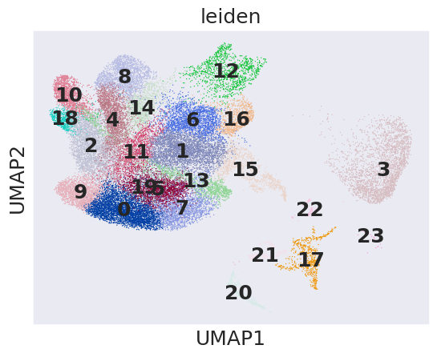
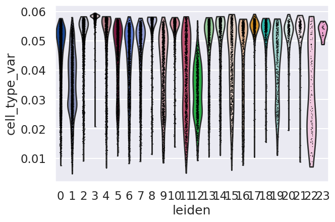
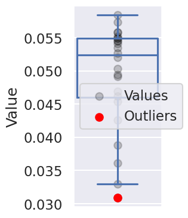
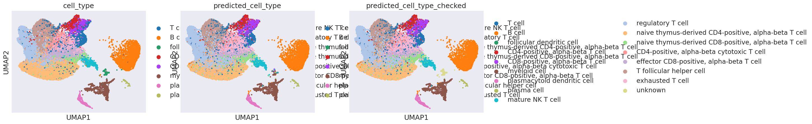
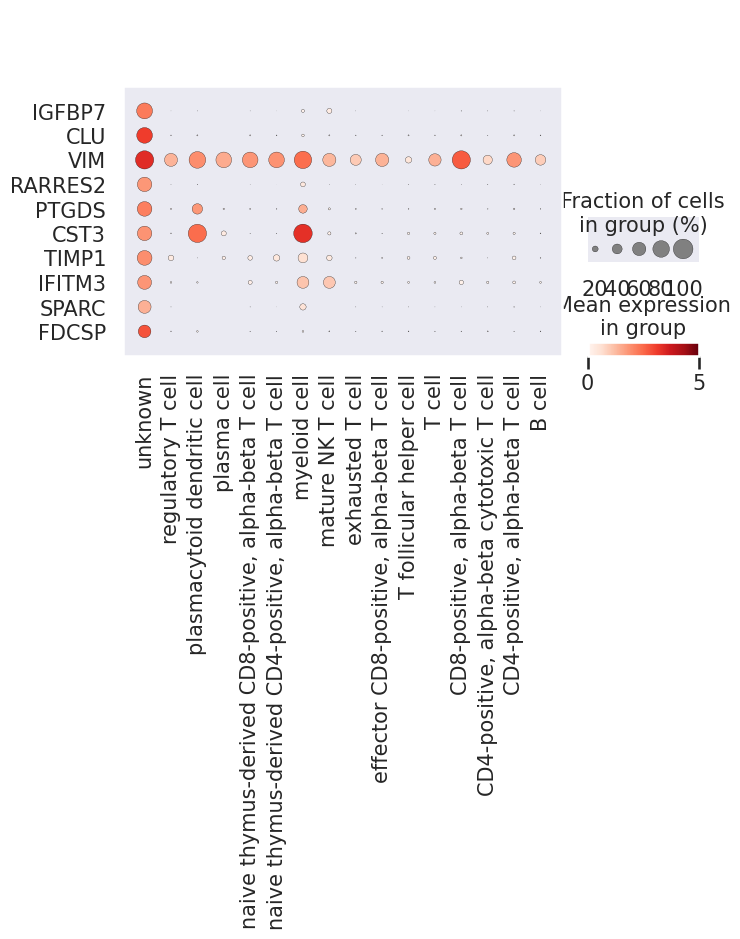
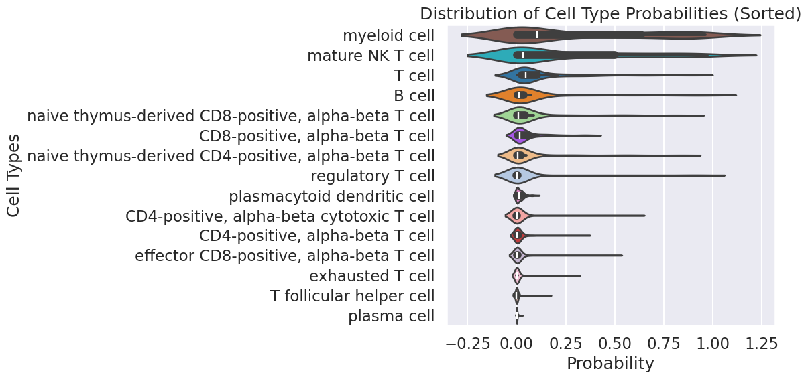

# 📘 Novel Cell Type Detection with UniCell

This tutorial demonstrates how to use **UniCell** for discovering novel or unseen cell types in single-cell data using a pre-trained model and reference ontology.

---

## 📂 Dataset and Setup
- Demo data can be downloaded from:  
https://bgipan.genomics.cn/#/link/15r5PAxuJO8NXaiGFIv3  
🔑 Extraction code: `OSxv`

- Pretrained models can be downloaded from:  
https://figshare.com/articles/online_resource/02_normal_to_disease/28901045

Make sure to download the dataset folder from your data source. The following assumes a structure like:

- `data/normal.h5ad`
- `data/disease.h5ad`
- `models/follicular_lymphoma`

---

## 🧭 Workflow Summary

1. Prepare the reference dataset and the query dataset.
2. Detect novel cell types.
3. Chatacterize novel cell types.


---

```python
import scanpy as sc
import pickle
from unicell.anno_predict import unicell_predict
import numpy as np
import matplotlib.pyplot as plt
import seaborn as sns
import pandas as pd
```

## Step 1: Prepare the reference dataset and the query dataset


```python
#### Prepare the training set and the evaluation set
adata_test = sc.read_h5ad("data/disease.h5ad")
ckpt_dir = "models/follicular_lymphoma"

#### prepare sc_dataset for following analysis
sc_dataset = unicell_predict(
    adata=adata_test,
    batch_size=512,
    filepath=None,
    ckpt_dir=ckpt_dir,
    device="cuda")
```

## Step 2: Detect novel cell types


```python
adata_normal = sc.read_h5ad("data/normal.h5ad")
adata_normal.var_names = adata_normal.var["feature_name"].tolist()
adata = sc.concat([sc_dataset.adata, adata_normal])

sc.pp.scale(adata)
sc.pp.pca(adata)
sc.pp.neighbors(adata, n_pcs = 20)
sc.tl.umap(adata)

adata_q = adata[adata.obs["disease"].isin(["follicular lymphoma"])].copy() # query adata
adata_r = adata[adata.obs["disease"].isin(["normal"])].copy() # reference adata

sc.pp.neighbors(adata_q, n_pcs=20)
sc.tl.leiden(adata_q)
```


```python
sc.pl.umap(adata_q, color = ["leiden"], legend_loc = "on data")
```

    


```python
import torch
cls_emb = torch.tensor(sc_dataset.adata.obsm["cls_emb"])
data = torch.softmax(cls_emb, dim=1).numpy()

adata_q.obs["cell_type_var"] = np.var(data, axis = 1)
sc.pl.violin(adata_q, keys=["cell_type_var"], groupby="leiden")
```

    


```python
# Group data by 'leiden' clustering and get the groupings
grouper = adata_q.obs.groupby(["leiden"]).grouper

# Compute the median of 'cell_type_var' for each 'leiden' cluster
group_var_means = adata_q.obs["cell_type_var"].groupby(grouper).median()

# Import median absolute deviation (not used in this code block but commonly used for robust statistics)
from scipy.stats import median_abs_deviation

# Compute standard deviation of median values across groups
sd = np.std(group_var_means)

# Calculate the first and third quartiles (Q1 and Q3)
Q1 = np.percentile(group_var_means, 25)
Q3 = np.percentile(group_var_means, 75)
IQR = Q3 - Q1  # Interquartile range

# Define the lower and upper bounds for outlier detection using IQR method
lower_bound = Q1 - 1.5 * IQR
upper_bound = Q3 + 1.5 * IQR

# Set threshold to the lower bound for identifying low-value outliers
threshold = lower_bound

# Identify groups whose median values fall below the lower threshold
outliers = group_var_means[group_var_means < threshold]

# Convert group_var_means to a pandas Series (ensure it's the correct type)
group_var_means = pd.Series(group_var_means)

# Create a DataFrame for plotting
data = pd.DataFrame({'Value': group_var_means.values})

# Plot a boxplot to show distribution of group median values
plt.figure(figsize=(3, 4))
sns.boxplot(y='Value', data=data, fill=None)
plt.ylabel('Value')

# Overlay all values as transparent black dots
plt.scatter(np.zeros(len(group_var_means)), group_var_means.values, color='black', label='Values', alpha=0.2)

# Highlight outlier values in red
plt.scatter(np.zeros(len(outliers)), outliers.values, color='red', label='Outliers', zorder=5)

# Add legend to distinguish points
plt.legend()

# Improve layout
plt.tight_layout()
plt.show()
```

    


```python
#### infer cell type UMAP
adata_test = sc_dataset.adata.copy()
adata_test.obsm["X_umap"] = adata[adata_test.obs_names].obsm["X_umap"]
adata_test.obs["leiden"] = adata_q.obs["leiden"]

adata_test.obs["predicted_cell_type"] = pd.Categorical(adata_test.obs["predicted_cell_type"])
adata_test.obs["predicted_cell_type_checked"] =  adata_test.obs["predicted_cell_type"].tolist()
adata_test.obs["predicted_cell_type_checked"][adata_test.obs["leiden"].isin(["22"])] = "unknown"
adata_test.obs["predicted_cell_type_checked"] = adata_test.obs["predicted_cell_type_checked"].astype("category")
adata_test.obs["predicted_cell_type"] = adata_test.obs["predicted_cell_type"].cat.set_categories(adata.obs["cell_type"].cat.categories)
adata_test.obs["predicted_cell_type_checked"] = adata_test.obs["predicted_cell_type_checked"].cat.set_categories(list(adata_test.obs["cell_type"].cat.categories)+["unknown"])

sc.pl.umap(adata_test, color = ["cell_type", "predicted_cell_type", "predicted_cell_type_checked"], size=50, show=False)
plt.show()
```

    


## Step 3: Chatacterize novel cell types


```python
adata_test.obs["predicted_cell_type_checked"] = adata_test.obs["predicted_cell_type_checked"].tolist()
sc.tl.rank_genes_groups(adata_test, groupby="predicted_cell_type_checked", method="wilcoxon", use_raw=False)
dedf = sc.get.rank_genes_groups_df(adata_test, group=None)
marker_dict = dedf.groupby("group").apply(
    lambda x: x.nlargest(10, "scores")["names"].tolist()
).to_dict()
adata_test.obs["predicted_cell_type_checked"] = adata_test.obs["predicted_cell_type_checked"].cat.set_categories(list(adata_test.obs["predicted_cell_type_checked"].cat.categories)[::-1])
sc.pl.dotplot(adata_test, groupby="predicted_cell_type_checked", var_names=marker_dict["unknown"], use_raw=False, vmax=5, swap_axes=True, show=False)
plt.show()
```


```python
import os
import torch
cls_emb = torch.tensor(sc_dataset.adata.obsm["cls_emb"])
data = torch.softmax(cls_emb, dim=1).numpy()
data = data[adata_test.obs["predicted_cell_type_checked"].isin(["unknown"])]

with open(os.path.join(ckpt_dir, 'celltype_dict.pk'), 'rb') as f:
    label_dict = pickle.load(f)
    idx2label = {label_dict[label]: label for label in label_dict}

cell_type_probs = pd.DataFrame(data)
cell_type_probs.columns = [sc_dataset.ontograph.id2name[v] for k, v in idx2label.items()]

#### Calculate the mean of each column and sort the columns
sorted_cell_type_probs = cell_type_probs.mean().sort_values(ascending=False)

#### Reorder the DataFrame based on the sorted column order
sorted_cell_type_probs_df = cell_type_probs[sorted_cell_type_probs.index]

#### Now you can proceed to plot the violin plot with the sorted DataFrame
import seaborn as sns
import matplotlib.pyplot as plt

plt.figure(figsize=(12, 6))

#### Create a horizontal violin plot
cell_type_color_dict = dict(zip(adata.obs["cell_type"].cat.categories,
                                adata.uns["cell_type_colors"]))
palette = {cell_type: cell_type_color_dict[cell_type] for cell_type in sorted_cell_type_probs_df.columns}
sns.violinplot(data=sorted_cell_type_probs_df, orient='h', palette=palette)

#### Add labels and title
plt.ylabel('Cell Types')
plt.xlabel('Probability')
plt.title('Distribution of Cell Type Probabilities (Sorted)')

#### Show the plot
plt.tight_layout()
plt.show()
```


    

    

