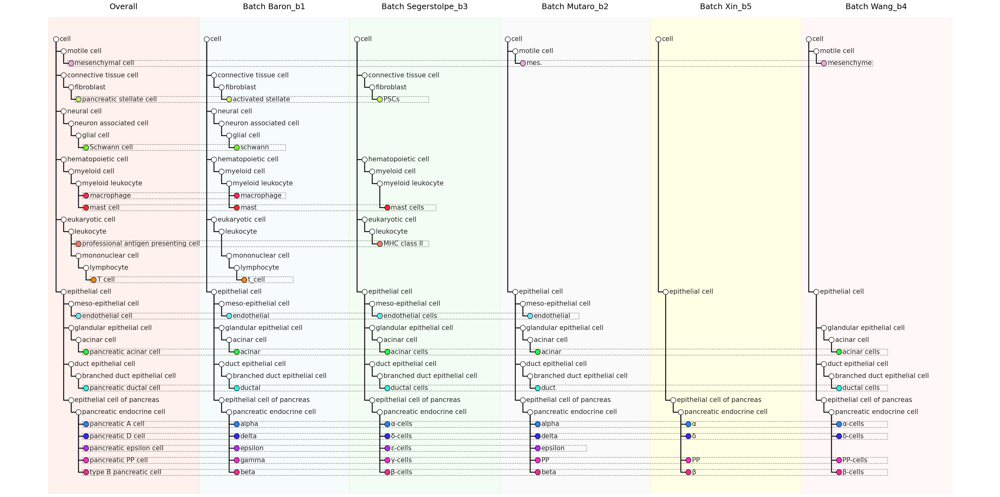
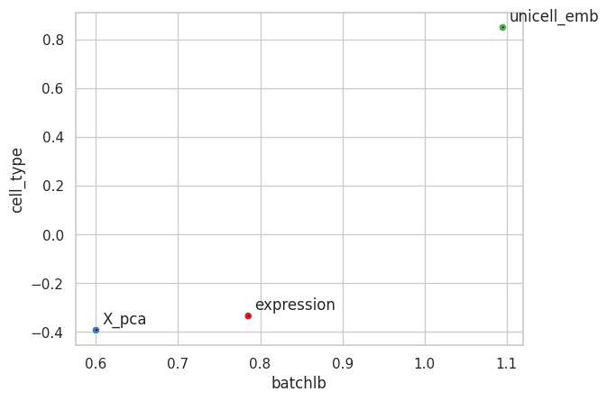
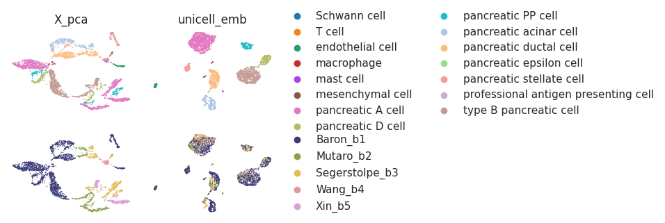
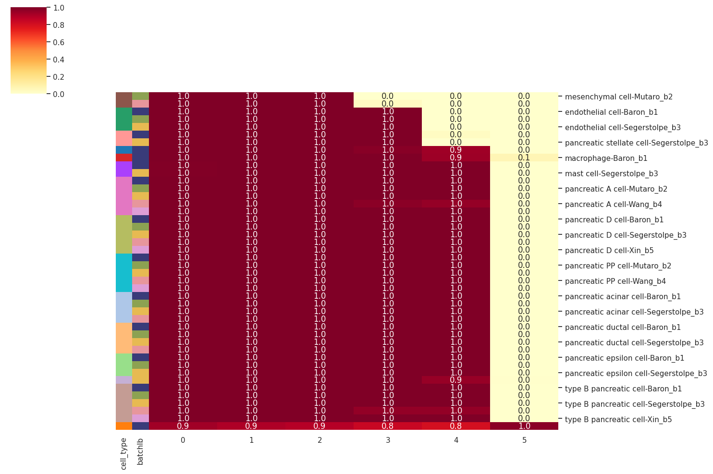

# 📘 Nomenclature Harmonization with UniCell

In this tutorial, we present three methods to evaluate UniCell's performance in nomenclature harmonization
---

## 📂 Dataset and Setup
- Demo data can be downloaded from:  
https://bgipan.genomics.cn/#/link/IYeuxM44drVE30X6sjf2  
🔑 Extraction code: `xskq`

- Pretrained models can be downloaded from:  
https://figshare.com/articles/online_resource/03_integration/28901888

Make sure to download the dataset folder from your data source. The following assumes a structure like:

- `data/hPan_test.h5ad`
- `models/hPan`

---

## 🧭 Workflow Summary

1. Create a cell type panel for harmonization  
2. Quantify harmonization effectiveness  
3. Assess hierarchical structure preservation

---

```python
import scanpy as sc
from unicell.ontoGRAPH import OntoGRAPH
import re
from sklearn.metrics import recall_score, precision_score, accuracy_score, f1_score
import pandas as pd
import matplotlib.pyplot as plt
import numpy as np
import matplotlib
from palettable.cartocolors.diverging import TealRose_5
from sklearn.metrics import silhouette_score
from scipy.spatial.distance import cdist
from scipy.sparse import issparse
import seaborn as sns
import pickle
import torch
from unicell.hmcn import HMCN
from unicell.dataset import HMCNDataset
from torch.utils.data import DataLoader
from unicell.anno_predict import collate_fn_with_args
from unicell.anno_predict import unicell_predict
import math
import colorsys
```

---

### Step 1: Create a cell type panel for harmonization 

---

```python
adata_test = sc.read_h5ad(f"data/hPan_test.h5ad")
device = "cuda"
ckpt_dir = "/home/share/huadjyin/home/s_huluni/project/UniCell/uploads/models/03_integration/hPan"
sc_dataset = unicell_predict(
    adata=adata_test,
    filepath=None,
    ckpt_dir=ckpt_dir,
    batch_size=512,
    device=device)

unique_batches = list(adata_test.obs["batchlb"].unique())
unique_batches.insert(0, 'Overall')
batchlb_celltype = {}
for i in unique_batches:
    if i == 'Overall':
        batchlb_celltype[i] = adata_test.obs['cell_type'].unique()
    else:    
        batchlb_celltype[i] = adata_test[adata_test.obs["batchlb"] == i].obs["cell_type"].unique()

cell_type_to_batches = {}
cell_type_orig_batches = {}
for idx, batch in enumerate(unique_batches):
    specified_cell_types = batchlb_celltype[batch].to_list()

    for cell_type in specified_cell_types:
        if cell_type not in cell_type_to_batches:
            cell_type_to_batches[cell_type] = set()
        cell_type_to_batches[cell_type].add(batch)
        
    if batch == 'Overall':
        cell_type_orig_batches[batch] = dict(zip(adata_test.obs["cell_type"],adata_test.obs["cell_type"]))
    else:
        cell_type_orig_batches[batch] = dict(zip(adata_test.obs["cell_type"][adata_test.obs["batchlb"].isin([batch])],
                                             adata_test.obs["celltype_orig"][adata_test.obs["batchlb"].isin([batch])]))
```

#### The values in the cell_type_orig_batches dictionary have been further manually curated.


```python

cell_type_orig_batches ={
  'Baron_b1': {
      'pancreatic A cell': 'alpha',
      'pancreatic D cell': 'delta',
      'type B pancreatic cell': 'beta',
      'pancreatic acinar cell': 'acinar',
      'endothelial cell': 'endothelial',
      'pancreatic ductal cell': 'ductal',
      'pancreatic PP cell': 'gamma',
      'pancreatic stellate cell': 'activated stellate',
      'pancreatic epsilon cell': 'epsilon',
      'mast cell': 'mast',
      'T cell': 't_cell',
      'Schwann cell': 'schwann',
      'macrophage': 'macrophage'},
  'Mutaro_b2': {
       'pancreatic A cell': 'alpha',
       'pancreatic acinar cell': 'acinar',
       'type B pancreatic cell': 'beta',
       'pancreatic ductal cell': 'duct',
       'pancreatic D cell': 'delta',
       'mesenchymal cell': 'mes.',
       'endothelial cell': 'endothelial',
       'pancreatic PP cell': 'PP',
       'pancreatic epsilon cell': 'epsilon'},
  'Segerstolpe_b3': {
      'pancreatic D cell': 'δ-cells',
      'pancreatic A cell': 'α-cells',
      'pancreatic ductal cell': 'ductal cells',
      'pancreatic PP cell': 'γ-cells',
      'pancreatic acinar cell': 'acinar cells',
      'pancreatic stellate cell': 'PSCs',
      'type B pancreatic cell': 'β-cells',
      'professional antigen presenting cell': 'MHC class II',
      'endothelial cell': 'endothelial cells',
      'pancreatic epsilon cell': 'ε-cells',
      'mast cell': 'mast cells'},
  'Wang_b4': {
      'type B pancreatic cell': 'β-cells',
      'pancreatic PP cell': 'PP-cells',
      'pancreatic A cell': 'α-cells',
      'pancreatic acinar cell': 'acinar cells',
      'pancreatic D cell': 'δ-cells',
      'pancreatic ductal cell': 'ductal cells',
      'mesenchymal cell': 'mesenchyme'},
  'Xin_b5': {
      'pancreatic A cell': 'α',
      'pancreatic PP cell': 'PP',
      'type B pancreatic cell': 'β',
      'pancreatic D cell': 'δ'}
  }
cell_type_orig_batches['Overall'] = dict(zip(adata_test.obs["cell_type"],adata_test.obs["cell_type"]))
```


```python
import networkx as nx

onto = sc_dataset.ontograph
G = onto.graph
G = nx.relabel_nodes(G, onto.id2name)
tree = nx.nx_agraph.to_agraph(G)
# Layout the graph using dot layout
tree.layout(prog='dot')

hierarchical_levels = onto.hierarchical_levels
id2name = onto.id2name
name_to_level = {id2name[key]: hierarchical_levels[key] for key in hierarchical_levels if key in id2name}

def count_children(node):
    count = 0
    for child in G.successors(node):
        if child == node:
            continue
        count += 1
        count += count_children(child)
    return count

def assign_coordinates(G, name_to_level):
    nodes = {}
    nodes['cell'] = (0, 0)
    level_to_nodes = {}

    for node, level in name_to_level.items():
        if level not in level_to_nodes:
            level_to_nodes[level] = []
        level_to_nodes[level].append(node)

    sorted_levels = sorted(level_to_nodes.keys())

    parent_rank = {}

    for level in sorted_levels:
        if level == 1:
            level_to_nodes[level].sort(key=lambda x: count_children(x), reverse=False)
            for idx, node in enumerate(level_to_nodes[level]):
                parent_rank[node] = idx
        else:
            level_to_nodes[level].sort(key=lambda x: (
                parent_rank[list(G.predecessors(x))[0]] if list(G.predecessors(x)) else -1,
                count_children(x)
            ), reverse=False)
            for idx, node in enumerate(level_to_nodes[level]):
                parent_rank[node] = idx
    
    sorted_level2nodes = {}
    for key in sorted(level_to_nodes):
        sorted_level2nodes[key] = level_to_nodes[key]

    for level, nodes_in_level in sorted_level2nodes.items():
        
        for node in nodes_in_level:
            parent = list(G.predecessors(node))
            if parent:
                parent_node = parent[0]
                parent_level = name_to_level[parent_node]
                parent_y = nodes[parent_node][1]
                siblings = [n for n in nodes_in_level if list(G.predecessors(n)) and list(G.predecessors(n))[0] == parent_node]
                sibling_rank = siblings.index(node)
                preceding_nodes = siblings[:siblings.index(node)]
                preceding_children_sum = sum(count_children(n) for n in preceding_nodes)

                y = parent_y - (sibling_rank + 1) - preceding_children_sum
            else:
                y = 0
            
            nodes[node] = (level, y)
    
    return nodes

def generate_edges(G, nodes):
    edges = []
    for edge in G.edges():
        source, target = edge
        source_coord = nodes[source]
        target_coord = nodes[target]
        intermediate_coord = (source_coord[0], target_coord[1])
        edges.append((source_coord, intermediate_coord, target_coord))
    return edges
```


```python
# Get the node positions
node_positions = {}
for node in tree.nodes():
    node_name = node.get_name()
    x, y = node.attr['pos'].split(',')
    node_positions[node_name] = (float(x), float(y))

theta = math.pi / 2  
rotation_matrix = np.array([[np.cos(theta), -np.sin(theta)],
                           [np.sin(theta), np.cos(theta)]])

for node_name, (x, y) in node_positions.items():
    new_position = rotation_matrix @ np.array([x, y])
    node_positions[node_name] = (new_position[0], new_position[1])

# Normalize and calculate hue/saturation with more separation
node_df = pd.DataFrame(node_positions).T
node_df['x'] = node_df[0] - node_df[0].min()
node_df['y'] = node_df[1] - node_df[1].min()

node_df['x'] = round(node_df['x'])
node_df['y'] = round(node_df['y'])

# Adjust scaling and quantize hue
node_df['saturation'] = node_df['x'].rank()/node_df['x'].rank().max()   # Non-linear scaling
node_df['hue'] = node_df['y'].rank()/node_df['y'].rank().max()  # Quantized hues

# Generate RGB colors
node_df['rgb'] = [
    colorsys.hsv_to_rgb(hue, saturation, (hue+saturation)/2*0.1 + 0.9)  # Keep value constant for brightness
    for hue, saturation in zip(node_df['hue'], node_df['saturation'])
]
```


```python
fig, ax = plt.subplots(figsize=(32, 16))

x_offset = 20

source = "cell"

for idx, batch in enumerate(unique_batches):
    
    specified_cell_types = set(batchlb_celltype[batch].to_list())
    current_offset = idx * x_offset

    background_color = {"Overall": "coral",
                        "Baron_b1": "lightblue",
                        "Segerstolpe_b3": "lightgreen", 
                        "Xin_b5": "yellow",
                        "Mutaro_b2": "lightgray",
                        "Wang_b4": "lightpink"}
    ax.axvspan(current_offset-1, current_offset + x_offset-1, color=background_color[batch], alpha=0.1, zorder=-2)
    
    relevant_nodes = set()
    for cell_type in specified_cell_types:
        path = nx.shortest_path(G, source=source, target=cell_type)
        relevant_nodes.update(path)
    
    nodes = assign_coordinates(G, name_to_level)
    nodes = {name: (x + current_offset, y) for name, (x, y) in nodes.items()}
    nodes_df = pd.DataFrame.from_dict(nodes, orient='index', columns=['x', 'y'])
    nodes_df.reset_index(inplace=True)
    nodes_df.rename(columns={'index': 'name'}, inplace=True)
    merged_nodes_df = pd.merge(nodes_df, node_df['rgb'], left_on='name', right_index=True)
    filtered_nodes_df = merged_nodes_df[merged_nodes_df['name'].isin(relevant_nodes)]
    replace_name = cell_type_orig_batches[batch]
    filtered_nodes_df['name'] = filtered_nodes_df['name'].replace(replace_name)
    
    edges = generate_edges(G, nodes)
    filtered_edges = []
    for (x1, y1), (x2, y2), (x3, y3) in edges:

        node1 = next(name for name, coord in nodes.items() if coord == (x1, y1))
        node3 = next(name for name, coord in nodes.items() if coord == (x3, y3))
        
        if node1 in relevant_nodes and node3 in relevant_nodes:
            filtered_edges.append(((x1, y1), (x2, y2), (x3, y3)))
    
    for (x1, y1), (x2, y2), (x3, y3) in filtered_edges:
        ax.plot([x1, x2], [y1, y2], 'k-')
        ax.plot([x2, x3], [y2, y3], 'k-')

    specified_cell_types = {replace_name.get(cell_type, cell_type) for cell_type in specified_cell_types}
    for i, j in filtered_nodes_df.iterrows():
        ax.text(j[1]+0.5, j[2], j[0], fontsize=15, ha='left', va='center', bbox=dict(facecolor='white', edgecolor='black', alpha=0))
        if j[0] in specified_cell_types:
            ax.plot(j[1], j[2], 'wo', markersize=12, markerfacecolor=j['rgb'], markeredgecolor='black')
        else:
            ax.plot(j[1], j[2], 'wo', markersize=12, markerfacecolor='white', markeredgecolor='black')
            
    ax.axis('off')
    if batch == "Overall":
        ax.text(current_offset+9, 3, f"{batch}", fontsize=18, ha='center', va='top', c='black')
    else:
        ax.text(current_offset+9, 3, f"Batch {batch}", fontsize=18, ha='center', va='top', c='black')
        
from matplotlib.patches import Rectangle
for cell_type, batches in cell_type_to_batches.items():
    if len(batches) > 1:
        cell_coords = []
        for idx, batch in enumerate(unique_batches):
            if batch in batches:
                current_offset = idx * x_offset
                # 获取该批次中该细胞类型的所有坐标
                for i, j in merged_nodes_df.iterrows():
                    if j[0] == cell_type:
                        x_pos = j[1] + current_offset 
                        cell_coords.append((x_pos, j[2], j['rgb']))
    x_values = [item[0] for item in cell_coords]
    x_min = min(x_values)
    x_max = max(x_values)
    y_center = cell_coords[0][1]
    rect = Rectangle((x_min-merged_nodes_df['x'].min()-0.5, y_center-0.25), 
                    x_max - x_min + 7,
                    0.5,
                    linewidth=1, edgecolor='gray', facecolor='none', linestyle='--')
    ax.add_patch(rect)

plt.tight_layout()
plt.show()
```


### Step 2: Quantify harmonization effectiveness  

---

```python
adata = sc_dataset.adata.copy()
adata.raw = adata.copy()
sc.pp.scale(adata)
sc.pp.pca(adata)
adata.X = adata.raw.X

labels = adata.obs["cell_type"].cat.codes
batch = adata.obs["batchlb"].cat.codes

asw_cell_type_dict = {}
asw_batch_dict = {}


for emb_key in ['expression', 'X_pca', 'unicell_emb']:
    if emb_key == 'expression':
        if issparse(adata.X):
            emb = adata.X.toarray()
    else:
        emb = adata.obsm[emb_key]
    
    distance_matrix = cdist(emb, emb)
    asw_cell_type = silhouette_score(distance_matrix, labels, metric="precomputed")
    asw_batch = silhouette_score(distance_matrix, batch, metric="precomputed")
        
    asw_cell_type_dict.update({emb_key:asw_cell_type})
    asw_batch_dict.update({emb_key:1-asw_batch})
    
asw_df = pd.DataFrame(asw_batch_dict.items(), columns=["method", "batchlb"])
asw_df["cell_type"] = asw_cell_type_dict.values()

x = asw_df["batchlb"]
y = asw_df["cell_type"]
labels = asw_df["method"].tolist()
# Create a dictionary to map labels to integer values
label_mapping = {label: i for i, label in enumerate(labels)}

# Transform the labels to integers using the label mapping
label_ints = [label_mapping[label] for label in labels]

# Set the style for the plot
sns.set(style='whitegrid')

# Define a discrete color palette
palette = sns.color_palette('Set1', len(label_mapping))

# Draw scatter plot with different colors based on label integers
sns.scatterplot(x=x, y=y, hue=label_ints, palette=palette, legend=False)

# Add labels to the data points
for i, label in enumerate(labels):
    plt.annotate(label, (x[i], y[i]), xytext=(5, 5), textcoords='offset points',
                 arrowprops=dict(arrowstyle='-', color='black'))

plt.show()
```


```python
for emb_key in ['X_pca', 'unicell_emb']:
    sc.pp.neighbors(adata, use_rep=emb_key)
    sc.tl.umap(adata)
    adata.obsm["umap_"+emb_key] = adata.obsm["X_umap"]
    
fig, ((ax1, ax2,), (ax3, ax4)) = plt.subplots(2, 2, figsize=(5, 3.5), gridspec_kw={"wspace": 0.1})

axes = [ax1, ax2, ax3, ax4]  
emb_key = ['X_pca', 'unicell_emb']
for i in range(2):
    adata.obsm["X_umap"] = adata.obsm["umap_"+emb_key[i]]
    
    ax = axes[i]
    ax.axis('off')  # Remove axis text and title
    if i < 1:
        sc.pl.umap(adata, color = "cell_type", legend_loc=None, ax=ax, show=False, size = 5)
    else:
        sc.pl.umap(adata, color = "cell_type", ax=ax, show=False, size = 5)
    title = re.sub("umap_", "", emb_key[i])
    ax.set_title(title)
    
    ax = axes[i+2]
    ax.axis('off')  # Remove axis text and title
    if i < 1:
        sc.pl.umap(adata, color = "batchlb", legend_loc=None, ax=ax, show=False, size = 4, palette = "tab20b")
    else:
        sc.pl.umap(adata, color = "batchlb", ax=ax, show=False, size = 4)
    ax.set_title("")
    
plt.tight_layout()
plt.show()
```


### Step 3: Assess hierarchical structure preservation

---

```python
model_path = os.path.join(ckpt_dir, 'unicell_v1.best.pth')
model_dict = torch.load(model_path)
metadata = model_dict["metadata"]

hierarchical_array = sc_dataset.ontograph.hierarchical_array
num_classes = len(hierarchical_array)
print("num_class:", num_classes)
hierarchical_class = [arr.shape[1] for arr in hierarchical_array]
hierarchical_depth = [metadata["global_layer"] if i > 0 else 0 for i in range(num_classes)]
global2local = [metadata["local_layer"] if i > 0 else 0 for i in range(num_classes)]
with open(os.path.join(ckpt_dir, 'celltype_dict.pk'), 'rb') as f:
    label_dict = pickle.load(f)
cls2id = {v:sc_dataset.ontograph.vocab[k] for k, v in label_dict.items()}

model = HMCN(input_type=metadata["input_type"],
             input_dim=metadata["input_dim"],
             output_dim=metadata["output_dim"],
             num_classes=num_classes,
             hierarchical_depth=hierarchical_depth,
             global2local=global2local,
             hierarchical_class=hierarchical_class,
             hidden_layer_dropout=metadata["hidden_layer_dropout"],
             cls_num=len(label_dict),
             llm_model_file=metadata["llm_model_file"],
             llm_vocab_file=metadata["llm_vocab_file"],
             llm_args_file=metadata["llm_args_file"])

params = {}
for k, v in model_dict["model_state_dict"].items():
    k = k.replace('module.', '')
    params[k] = v
model.load_state_dict(params)
model = model.eval().to(device)

global_outs = []
batch_size = 128

dataset = HMCNDataset(sc_dataset, input_type=metadata["input_type"])
dataloader = DataLoader(dataset, batch_size=batch_size,
                        collate_fn=collate_fn_with_args(input_type=metadata["input_type"], model=model))

with torch.no_grad():
    for _, (batch_data, batch_labels, cls_labels) in enumerate(dataloader):

        if metadata["input_type"] in "GeneFormer":
            batch_data = {k: v.to(device) for k, v in batch_data.items()}
            model.geneformer = model.geneformer.to(device)
        elif metadata["input_type"] == "scGPT":
            batch_data = {
                "input_ids": torch.stack([b["input_ids"] for b in batch_data]).to(torch.long).to(device),
                "values": torch.stack([b["values"] for b in batch_data]).to(device)}
        else:
            batch_data = torch.stack(batch_data).to(device)

        _, global_out, _, _ = model(batch_data)
        global_outs.append(global_out)
```


```python
# hPan global level heatmap

with open(os.path.join(ckpt_dir, 'celltype_dict.pk'), 'rb') as f:
    label_dict = pickle.load(f)
    idx2label = {label_dict[label]: label for label in label_dict}

adata.obsm["global_emb"] = torch.cat(global_outs).detach().cpu().numpy()
group_labels = adata.obs["cell_type"].astype(str) + "-" + adata.obs["batchlb"].astype(str)
cell_type_probs = pd.DataFrame(adata.obsm["global_emb"], index = adata.obs_names).groupby(group_labels).mean()

cell_type_probs = cell_type_probs.loc[round(cell_type_probs).sum(axis=1).sort_values().index, :]

unique_sums = round(cell_type_probs).sum(axis=1).unique()
sorted_indices = []
for s in unique_sums:
    sub_df = cell_type_probs.loc[round(cell_type_probs).sum(axis=1) == s, :]
    sorted_indices.extend(sub_df.sort_index().index)
    
cell_type_probs = cell_type_probs.loc[sorted_indices, :]

row_colors = (
    cell_type_probs
    .reset_index()
    .set_index(cell_type_probs.index)
    .loc[:, "index"]
    .str.split("-", expand=True)
    .rename(columns={0: "cell_type", 1: "batchlb"})
)
row_colors['cell_type'] = row_colors['cell_type'].map(dict(zip(adata.obs["cell_type"].cat.categories, adata.uns["cell_type_colors"])))
row_colors['batchlb'] = row_colors['batchlb'].map(dict(zip(adata.obs["batchlb"].cat.categories, adata.uns["batchlb_colors"])))

plt.figure(figsize=(15, 10))
sns.clustermap(cell_type_probs, annot=True, cmap='YlOrRd', vmin=0, vmax=1, fmt=".1f", xticklabels=True, row_colors=row_colors, row_cluster=False, col_cluster=False, figsize=(15, 10))
plt.show()
```

