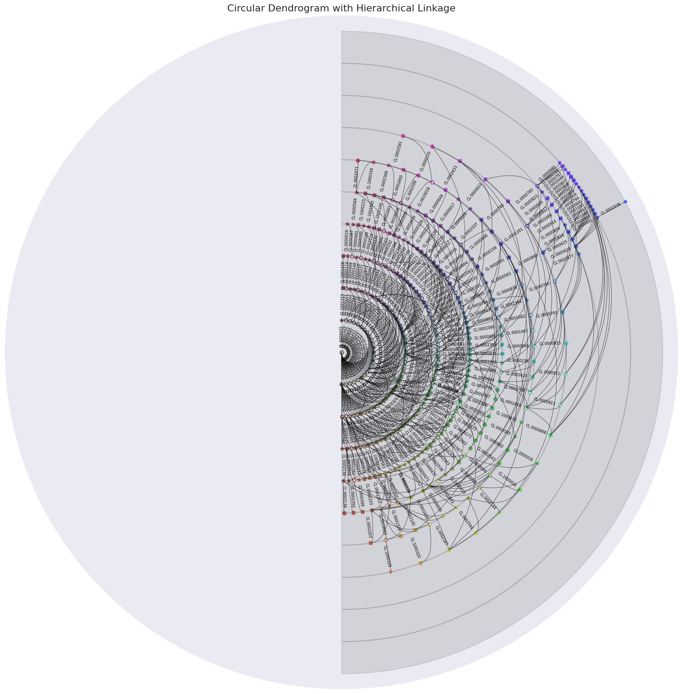
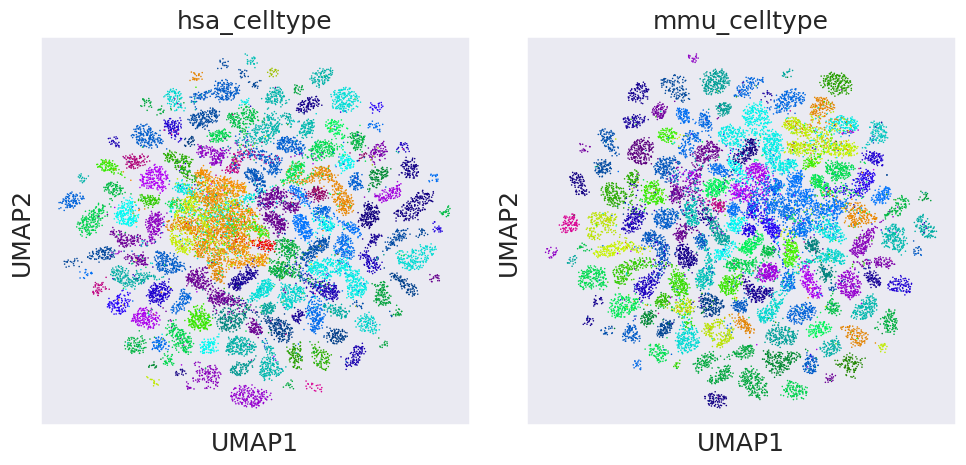

# 📘 Constructing and Benchmarking the Atlas-Level Reference

This tutorial demonstrates how to construct and evaluate an atlas-level reference using the best-trained UniCell model.

---

## 📂 Dataset and Setup
- [Mouse list](mmu_species_atlas_unique_celltype_ids_list.txt)  
- [Human list](hsa_species_atlas_unique_celltype_ids_list.txt)
- Demo data can be downloaded from:  
https://bgipan.genomics.cn/#/link/okkugw76hwOvpM2T6tFz  
🔑 Extraction code: `CuMF`

- Pretrained models can be downloaded from:  
https://figshare.com/articles/online_resource/04_atlas/28943645  


Assumed structure:
```
- mmu_species_atlas_unique_celltype_ids_list.txt
- hsa_species_atlas_unique_celltype_ids_list.txt
- models/04_atlas/hca
- models/04_atlas/mca
- data/hsa/eval.h5ad
- data/mmu/eval.h5ad
```

---

## 🧭 Workflow Summary

1. Create a panel for atlas-level reference  
2. Visualize the atlas-level reference using UMAP  

---

## 🧭 Step 1: Create a Panel for Atlas-Level Reference

This step constructs the reference ontology combining both human and mouse cell types, assigns hierarchy, and generates coordinates and colors for plotting.

```python
import pandas as pd
import numpy as np
import networkx as nx
from unicell.ontoGRAPH import OntoGRAPH
import math
from matplotlib import cm
import matplotlib.pyplot as plt
import scanpy as sc
from unicell.anno_predict import unicell_predict

with open("mmu_species_atlas_unique_celltype_ids_list.txt", "r") as f:
    mmu_species_atlas_unique_celltype_ids_list = [line.strip() for line in f]
with open("hsa_species_atlas_unique_celltype_ids_list.txt", "r") as f:
    hsa_species_atlas_unique_celltype_ids_list = [line.strip() for line in f]

union_celltype_ids_list = list(set(mmu_species_atlas_unique_celltype_ids_list) | set(hsa_species_atlas_unique_celltype_ids_list))
onto = OntoGRAPH(cell_type=union_celltype_ids_list)
union_id2name = onto.id2name
union_celltype_list = [union_id2name[celltype_id] for celltype_id in union_celltype_ids_list]
```

```python
def count_descendants(node):
    """Calculate the total number of descendant nodes for a given node"""
    count = 0
    for child in G.successors(node):
        if child == node:
            continue  # Skip self-loops
        count += 1  # Count current child node
        count += count_descendants(child)  # Recursively count descendants of child
    return count

def assign_coordinates(G, hierarchical_levels):
    node_coordinates = {}
    node_coordinates['cell'] = (0, 0)  # Assume root node coordinates are (0, 0)
    level_to_nodes = {}

    for node, level in hierarchical_levels.items():
        if level not in level_to_nodes:
            level_to_nodes[level] = []
        level_to_nodes[level].append(node)

    sorted_levels = sorted(level_to_nodes.keys())

    parent_rank = {}

    for level in sorted_levels:
        if level == 1:
            level_to_nodes[level].sort(key=lambda x: count_descendants(x), reverse=True)
            for idx, node in enumerate(level_to_nodes[level]):
                parent_rank[node] = idx
        else:
            level_to_nodes[level].sort(key=lambda x: (
                parent_rank[list(G.predecessors(x))[0]] if list(G.predecessors(x)) else -1,
                count_descendants(x)
            ), reverse=True)
            for idx, node in enumerate(level_to_nodes[level]):
                parent_rank[node] = idx

    sorted_level2nodes = {}
    for key in sorted(level_to_nodes):
        sorted_level2nodes[key] = level_to_nodes[key]

    for level, nodes_in_level in sorted_level2nodes.items():
        for node in nodes_in_level:
            parents = list(G.predecessors(node))
            if parents:
                parent_node = parents[0]
                parent_y = node_coordinates[parent_node][1]
                
                siblings = [n for n in nodes_in_level if list(G.predecessors(n)) and list(G.predecessors(n))[0] == parent_node]
                sibling_rank = siblings.index(node)
                preceding_nodes = siblings[:siblings.index(node)]
                preceding_children_sum = sum(count_descendants(n) for n in preceding_nodes)
                y = parent_y - (sibling_rank + 1) - preceding_children_sum
            else:
                y = 0
            
            node_coordinates[node] = (level, y)
    
    return node_coordinates
```

```python
G = onto.graph  
for node in G.nodes:
    G.nodes[node].clear()
tree = nx.nx_agraph.to_agraph(G)
tree.layout(prog='dot')

hierarchical_levels = onto.hierarchical_levels
id2name = onto.id2name
name_to_level = {id2name[key]: hierarchical_levels[key] for key in hierarchical_levels if key in id2name}

node_positions = {}
for node in tree.nodes():
    node_name = node.get_name()
    x, y = node.attr['pos'].split(',')
    node_positions[node_name] = (float(x), float(y))
    
theta = math.pi / 2  
rotation_matrix = np.array([[np.cos(theta), -np.sin(theta)],
                           [np.sin(theta), np.cos(theta)]])

for node_name, (x, y) in node_positions.items():
    new_position = rotation_matrix @ np.array([x, y])
    node_positions[node_name] = (new_position[0], new_position[1])

node_df = pd.DataFrame(node_positions).T

for node_name, (x, y) in node_positions.items():
    node_positions[node_name] = (x + abs(node_df[0].min()), y)

node_df[0] = node_df[0] + abs(node_df[0].min())
node_df['x'] = (node_df[0].max() - node_df[0]) / node_df[0].max()
node_df['y'] = (node_df[1].max() - node_df[1]) / node_df[1].max()

source = "cell"

specified_cell_types = union_celltype_ids_list

nodes = assign_coordinates(G, hierarchical_levels)
nodes = {name: (x, y) for name, (x, y) in nodes.items()}
nodes_df = pd.DataFrame.from_dict(nodes, orient='index', columns=['x', 'y'])
nodes_df.reset_index(inplace=True)
nodes_df.rename(columns={'index': 'name'}, inplace=True)
nodes_df = nodes_df.iloc[1:]

nodes_df['y_norm'] = nodes_df.groupby('x')['y'].transform(
    lambda group: group.min() + (group.rank() - 1) * (group.max() - group.min()) / (len(group) - 1)
    if group.max() > group.min() else group
)
pos_dict = {row["name"]: (-.5*np.pi + abs(row["y_norm"])/max(abs(nodes_df["y_norm"]))*np.pi, row["x"]) for _, row in nodes_df.iterrows()}
# Calculate min and max for x and y
x_min = min([x for node, (x, y) in pos_dict.items()])
x_max = max([x for node, (x, y) in pos_dict.items()])
y_min = min([y for node, (x, y) in pos_dict.items()])
y_max = max([y for node, (x, y) in pos_dict.items()])

colormap = cm.get_cmap('hsv')
# Vectorize the color computation
color_dict = {
    node: tuple(
        np.array(colormap((hue - x_min) / (x_max - x_min)))[:3] *
        ((sa - y_min)/(y_max - y_min))*0.7 + 0.3)
    for node, (hue, sa) in pos_dict.items()
}
node_df["Species"] = None
node_df["Species"][node_df.index.isin(list(set(mmu_species_atlas_unique_celltype_ids_list) & set(hsa_species_atlas_unique_celltype_ids_list)))] = "overlapped"
node_df["Species"][node_df.index.isin(list(set(hsa_species_atlas_unique_celltype_ids_list) - set(mmu_species_atlas_unique_celltype_ids_list)))] = "human"
node_df["Species"][node_df.index.isin(set(mmu_species_atlas_unique_celltype_ids_list) - set(hsa_species_atlas_unique_celltype_ids_list))] = "mouse"

species_dict = dict(zip(node_df.index, node_df["Species"]))
species_marker_dict = {"overlapped": "o", "human":"*", "mouse":"X"}
```

```python
def plot_lines(parent_pos, children_pos, ax):
    x, y = parent_pos
    for xc, yc in children_pos:
        # Create a set of points for a smooth curve
        t = np.linspace(0, 1, 100)
        # Define the curve parameters
        control_height = 0.3  # Height of the control point for the curve
        curve_x = (1 - t) * x + t * xc
        curve_y = (1 - t) * y + t * yc + control_height * np.sin(t * np.pi)  # Sine wave for smoothness

        # Plot the curve
        ax.plot(curve_x, curve_y, color='k', linewidth=0.5)
        
def plot_tree(G, pos_dict, ax):
    for node in G.nodes:
        children_pos = [pos_dict[child] for child in G.successors(node)]
        plot_lines(pos_dict[node], children_pos, ax)

    for node, (x, y) in pos_dict.items():
        shape = species_marker_dict.get(species_dict[node], "o")
        if species_dict[node] is not None:
            ax.scatter([x], [y], s=30, color=color_dict[node], marker = shape)
        else:
            ax.scatter([x], [y], s=30, color=color_dict[node], marker = shape, facecolors="white")
        
        angle = np.degrees(x)  
        
        if 90 < angle < 270:
            angle += 180  
            
        ax.text(x, y-0.5, str(node), rotation = angle, fontsize=6, ha='center', va='center', color='black')

def draw_gray_rings(ax, max_depth):
    radii = np.linspace(0, 10, max_depth + 1)  
    for i in range(max_depth):
        ax.fill_between(np.linspace(-.5*np.pi, .5*np.pi, 100), radii[i], radii[i + 1], color="#000000", alpha=0.1)

def draw_tree(G, pos_dict):
    fig, ax = plt.subplots(figsize=(20, 20), subplot_kw=dict(projection='polar'))
    ax.set_xticks([])
    ax.set_yticks([])

    # 计算树的最大深度
    root = [n for n in G.nodes if G.in_degree(n) == 0][0]  # 找到根节点
    max_depth = max(nx.single_source_shortest_path_length(G, root).values())

    draw_gray_rings(ax, max_depth)  # 绘制灰度环
    plot_tree(G, pos_dict, ax)

    plt.title("Circular Dendrogram with Hierarchical Linkage", fontsize=16)
    # plt.savefig("/home/share/huadjyin/home/s_huluni/project/bio_tools/CATree/case/Fig5_atlas/plotting/figs/Fig5_atlas_tree.pdf")
    plt.show()


draw_tree(G, pos_dict)
```


---

## 🧭 Step 2: Visualize the Atlas-Level Reference Using UMAP

This step projects both human and mouse cell types into UniCell latent space, colored by unified ontology.

```python
def rgb_to_hex(rgb):
    rgb_int = [int(c * 255) for c in rgb]
    return '#{:02x}{:02x}{:02x}'.format(*rgb_int)


node_df['rgb'] = [
    # Get RGB values from the colormap for hue
    tuple(np.array(colormap(hue)[0:3]) * (0.5 * sa + 0.5))  # Scale RGB values by saturation
    for hue, sa, in zip(node_df["x"], node_df["y"])
]

union_celltype_rgb_dict = dict(zip(node_df.index.tolist(),
                                   node_df["rgb"].apply(lambda x: rgb_to_hex(x)).tolist()))
device = "cuda"
ckpt_dir = "models/04_atlas/hca"
test_data_path = "data/hsa/eval.h5ad"
adata_test = sc.read_h5ad(test_data_path)
sc.pp.normalize_total(adata_test)
sc.pp.log1p(adata_test)
sc.pp.filter_cells(adata_test, min_genes=200)

sc_dataset = unicell_predict(
    adata=adata_test,
    batch_size=64,
    filepath=None,
    ckpt_dir=ckpt_dir,
    device=device)

hsa_adata = sc_dataset.adata.copy()
hsa_adata = hsa_adata[hsa_adata.obs["cell_type_ontology_term_id"].isin(list(union_celltype_rgb_dict.keys()))]
unique_categories = hsa_adata.obs["cell_type_ontology_term_id"].cat.categories
colors = [union_celltype_rgb_dict[cat] for cat in unique_categories]
hsa_adata.uns["cell_type_ontology_term_id_colors"] = colors

sc.pp.neighbors(hsa_adata, use_rep="unicell_emb", n_neighbors=50)
sc.tl.umap(hsa_adata, min_dist=2)
device = "cuda"
ckpt_dir = "models/04_atlas/mca"
test_data_path = "data/mmu/eval.h5ad"
adata_test = sc.read_h5ad(test_data_path)
sc.pp.normalize_total(adata_test)
sc.pp.log1p(adata_test)
sc.pp.filter_cells(adata_test, min_genes=200)

sc_dataset = unicell_predict(
    adata=adata_test,
    batch_size=64,
    filepath=None,
    ckpt_dir=ckpt_dir,
    device=device)

mmu_adata = sc_dataset.adata
mmu_adata = mmu_adata[mmu_adata.obs["cell_type_ontology_term_id"].isin(list(union_celltype_rgb_dict.keys()))]
unique_categories = mmu_adata.obs["cell_type_ontology_term_id"].cat.categories
colors = [union_celltype_rgb_dict[cat] for cat in unique_categories]
mmu_adata.uns["cell_type_ontology_term_id_colors"] = colors

sc.pp.neighbors(mmu_adata, use_rep="unicell_emb", n_neighbors=50)
sc.tl.umap(mmu_adata, min_dist=2)


fig, axes = plt.subplots(1, 2, figsize=(10, 5), facecolor='none')

sc.pl.umap(hsa_adata, color="cell_type_ontology_term_id", show=False, legend_loc=None, size=5, ax=axes[0])
axes[0].set_title("hsa_celltype")

sc.pl.umap(mmu_adata, color="cell_type_ontology_term_id", show=False, legend_loc=None, size=5, ax=axes[1])
axes[1].set_title("mmu_celltype")

plt.tight_layout()
plt.show()
```

---

